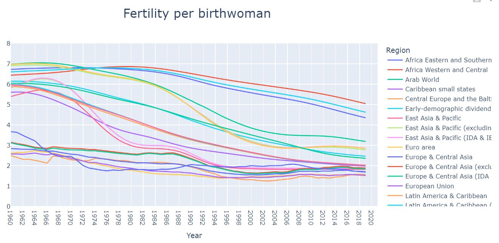
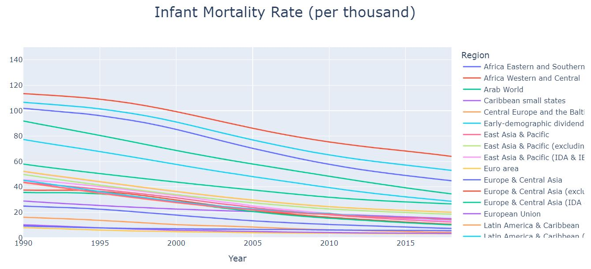
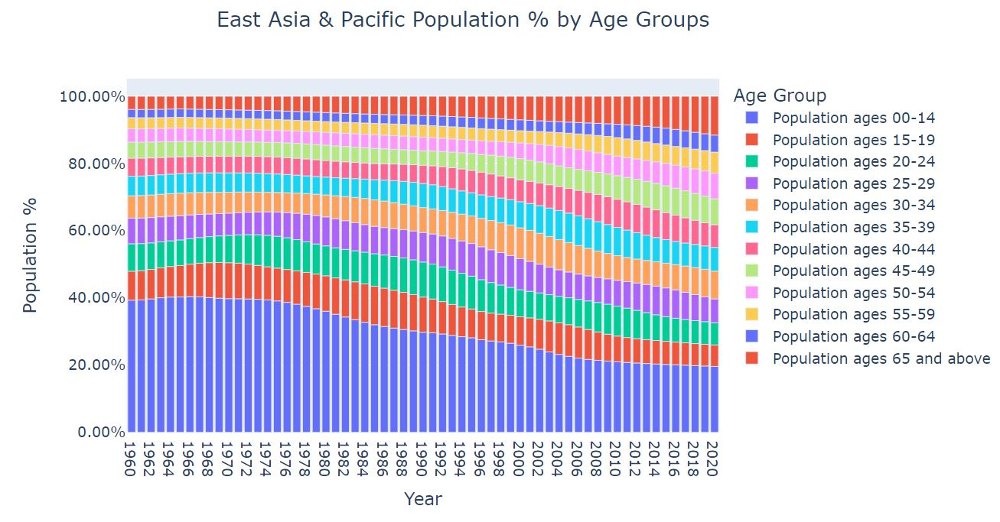

## Health Nutrition and Population Statistics Visualization

Based on the [data provided by The World Bank](https://datacatalog.worldbank.org/search/dataset/0037652/Health-Nutrition-and-Population-Statistics), I have created visualizations on birth rate, infant mortality and population trends in the last few decades. **Please note: since the ipynb notebook does not provide plotly charts, please visit [here](https://nbviewer.org/github/jayhoneylee527/Health-Nutrition-and-Population-Statistics-Visualization/blob/main/HNP_visualization.ipynb) for full notebook.**

### Datasets
The data.zip consists of two files:
1) HNP_StatsCountry.csv: Country and Region names 
2) HNP_StatsData.csv: Diverse statistics for each country and region

### Summary

#### Fertility & Infant Mortality Rates
After birth rates have declined rapidly in the late 20th century in major countries, they have remained unchanged for few decades. However, what may be surprising the relatively fast decrease among developing countries - South East Asia, Latin America & Africa. Could this mean that the population growth will slow down in coming era? 

  

At the same time, we must take a look at how infant mortality has changed in recent years. 

  

In 30 years, some continents (especially those of low development) saw more than 50% decrease in the infant mortalities. By now, this rate remains below 8% for all regions. The data shows that particularly in Africa, South East Asia & Latin America, women now give fewer births that have much higher chances of survival.    

#### Demographics Changes 
The trends of demographics also depend on the regions. The most alarming change, in fact, is occurring in East Asia which consist of Asian countries with advanced economies and living standards.

  

Within half a centry, the percentage of young population (age 0 -19) almost halved. Meanwhile, that of old population (over 65) nears 20%. The forewarning of looming high age society is not an exaggeration.

#### Health Expenditures vs. Infant Mortality
